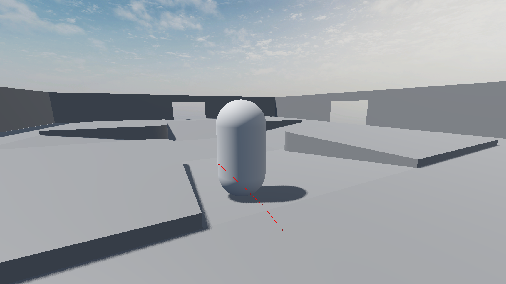

# Week 4 (Febuary 16 to 22)

During Week 4, I created a basic test_npc node that would continously, once a second, try to find a path to the player, and if it found one, it would move along that path, jumping if it had to. This test_npc used the Godot NavigationAgent3D for navigation, and the scene was the scene that was created by other members of the scene, I just added the NavigationRegion3D so that I could see it in action. With the proof that I can do basic navigation, I could next figure out what kind of layout would I actually be expecting out of the final map.

