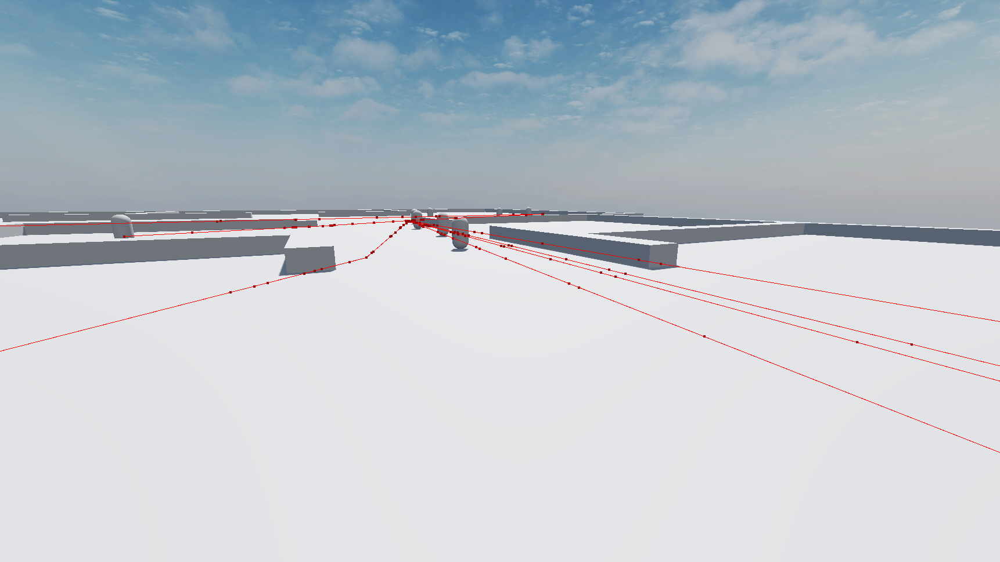

# Week 5 (Febuary 23 to March 1)
During Week 5, I created a basic testing scene that would get me a rough idea of what kind of area I'd be working with for the final game area. I also created a task_npc node and npc_manager node that would hopefully evolve into what I needed out of the npcs. The npc_manager is meant to handle all the many npcs, it's meant to spawn them and set them to their tasks. While each npc is a task_npc which has a set of tasks, 3d positions, that they need to go to, and after they're done, they get to be freed.

