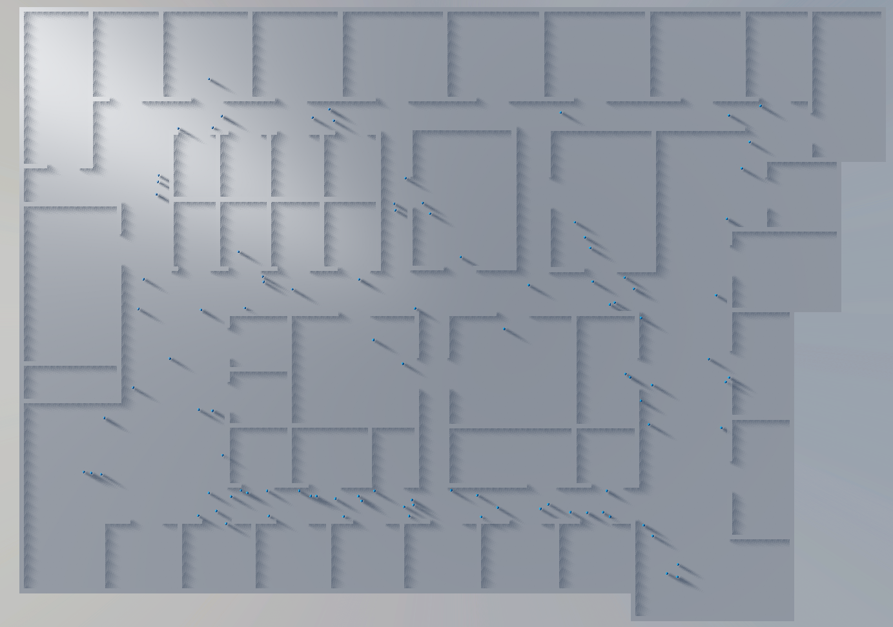

# Week 7 (March 9 to 15)
In week 7 I figured out a way to setup so each task_npc node counted as an obstacle for the others to avoid. So that somewhat made it, so they somewhat worked now. I still had a lot of testing to do, but as long as the amount of npcs remained low enough, and the scenes weren't too small, it should work.

